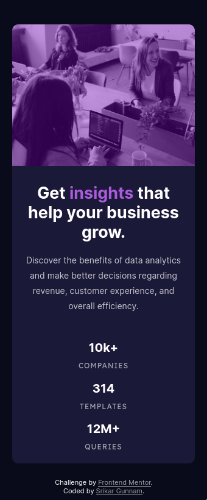

# Frontend Mentor - Stats preview card component solution

This is a solution to the [Stats preview card component challenge on Frontend Mentor](https://www.frontendmentor.io/challenges/stats-preview-card-component-8JqbgoU62). Frontend Mentor challenges help you improve your coding skills by building realistic projects. This is my fourth project from Frontend Mentor, really enjoying it, a must try platform for everyone who want to learn, experiment and enhance their frontend skills.

## Table of contents 📋

  - [Overview](#overview)
    - [Screenshots](#screenshots)
      - [Mobile view](#mobile-view)
      - [Tablet view](#tablet-view)
      - [Desktop view](#desktop-view)
    - [Links](#links)
  - [My process](#my-process)
    - [Built with](#built-with)
    - [What I learned](#what-i-learned)
    - [Continued development](#continued-development)
    - [Useful resources](#useful-resources)
  - [Author](#author)
  - [Acknowledgments](#acknowledgments)

## Overview 👀

### The challenge

Users should be able to:

- View the optimal layout depending on their device's screen size

### Screenshots

#### Mobile view

 

#### Tablet view

#### Desktop view

### Links

- [Solution URL](https://github.com/srikargunnam/frontendmentor-stats-preview)
- [Live Site URL](https://srikargunnam.github.io/frontendmentor-stats-preview/)

## My process 📜

### Built with

- Semantic HTML5 markup
- Mobile-first workflow
- CSS custom properties
- CSS media queries
- CSS Grid
- Flexbox

### What I learned 🧠💡

This is a newbie challange, but a great one, this was a kick-start for me to use _**CSS grid**_, I was little confused at my first sight of the project, whether to go with CSS grid or flexbox, i was little bias towards flexbox as I used it the most, but I figured out by seeing few videos that grid is more flexible than flexbox, I watched few videos of [Kevin Powell](https://www.kevinpowell.co/) which helped to get a good understanding of grid layouts and how _**grid-template-areas**_ are so efficient for responsive web design.

Also i was wondering how i could make the fontsize responsive, then i went through few articles and videos which helped me in defining the fontsize based on **vw (view width)**, but i would have gone wrong if had used this trick this without watching [Kevin's video](https://www.youtube.com/watch?v=U9VF-4euyRo&t=616s) where he expanined how just using this **vw** can go wrong and how using min() 0r max() can fix the issue.

### Continued development 🏗

I used CSS grid for responsive design, it was both fun and frustrating, but finally i managed to get the output as i expected, 

I will try to use CSS grid and get a good grip on using it for my responsive web designs.

### Useful resources 📚	🗃

- [MDN Web Docs](https://developer.mozilla.org/en-US/docs/Web) - best place to get the complete understanding of css properites, they have a search bar which is really cool in getting the right resource without wasting time wandering around.
- [Kevin Powell's youtube channel](https://www.youtube.com/channel/UCJZv4d5rbIKd4QHMPkcABCw) - will have videos on almost all the css needs.
- [Mosh Hamedani's youtube channel](https://www.youtube.com/c/programmingwithmosh) - he has a git beginner video, which is really helpful.

## Author 👦

### Srikar Gunnam

- Website - [srikargunnam.com](https://srikargunnam.com) 	🕸
- Frontend Mentor - [@srikargunnam](https://www.frontendmentor.io/profile/srikargunnam)
- Twitter - [@SrikarGunnam](https://twitter.com/SrikarGunnam)
- Codepen - [@srikargunnam](https://codepen.io/srikargunnam)
- GitHub - [@srikargunnam](https://github.com/srikargunnam/)
**Note: Delete this note and add/remove/edit lines above based on what links you'd like to share.**

## Acknowledgments 🏷

Thanks a lot to Frontend Mentor for giving such an amazing opportunity to everyone who want to become a frontend developer and to everyone out there who are creating helpfull resources in the form of articles 📰 and videos 🎞 which helped me & many other fellow members, and the bonus part here is many such resources out there are free of cost.
